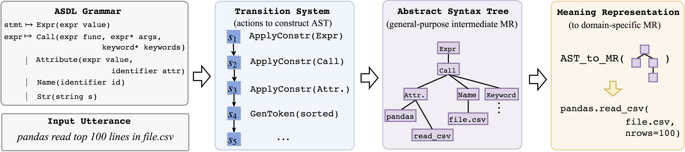

# TranX

A general-purpose **Tran**sition-based abstract synta**X** parser 
that maps natural language queries into machine executable 
source code (e.g., Python) or logical forms (e.g., lambda calculus).

## System Architecture

Details could be found in [this](doc/report.pdf) technical report. 
To cope with different 
domain specific logical formalisms (e.g., SQL, Python, lambda-calculus, 
prolog, etc.), TranX uses abstract syntax trees (ASTs) defined in the 
Abstract Syntax Description Language (ASDL) as intermediate meaning
representation.



Figure 1 gives a brief overview of the system.

1. TranX first employs a transition system to transform a natural language utterance into a sequence of tree-constructing actions, following the input grammar specification of the target formal language. The grammar specification is provided by users in textual format (e.g., `asdl/lang/py_asdl.txt` for Python grammar).

2. The tree-constructing actions produce an intermediate abstract syntax tree. TranX uses ASTs defined under the ASDL formalism as general-purpose, intermediate meaning representations.

3. The intermediate AST is finally transformed to a domain-specific representation (e.g., Python source code) using customly-defined conversion functions.

**File Structure** tranX is mainly composed of two components: 

1. A general-purpose transition system that defines the generation process of an AST `z`
 using a sequence of tree-constructing actions `a_0, a_1, ..., a_T`.
2. A neural network that computes the probability distribution over action sequences, conditional on the natural language query `x`, `p(a_0, a_1, ..., a_T | x)`.

These two components are implemented in the following two folders, respectively:

* `asdl` defines a general-purpose transition system based on the ASDL formalism, and its instantiations in different programming languages and datasets.
The transition system defines how an AST is constructed using a sequence of actions.
This package can be used as a standalone library independent of tranX.
See Section 2.2 of the technical report for details.
* `model` contains the neural network implementation of the transition system defined in `asdl`, which computes action probabilities using neural networks.
See Section 2.3 of the technical report for details.

Additionally, the `components` folder contains helper functions and classes (e.g., vocabulary). 

## Supported Language

TranX officially supports the following grammatical formalism and datasets.
More languages (C#) are coming! 

Language | ASDL Specification | Example Datasets
---------|--------------------| --------
Python   | `asdl/lang/py_asdl.txt` | Django (Oda et al., 2015)
lambda calculus| `asdl/lang/lambda_asdl.txt` | ATIS, GeoQuery (Zettlemoyer and Collins, 2005)
prolog | `asdl/lang/prolog_asdl.txt`  | Jobs (Zettlemoyer and Collins, 2005)
SQL | `asdl/lang/sql/sql_asdl.txt` | WikiSQL (Zhong et al., 2017)

## Usage

**Conda Environments** TranX supports both Python 2.7 and 3.5. Please note that 
some datasets only support Python 2.7 (e.g., Django) or Python 3+ (e.g., WikiSQL). We provide example
conda environments (`data/env/(py2torch3cuda9.yml|py3torch3cuda9.yml)`) for both Python versions.

```bash
git clone https://github.com/pcyin/tranX
cd tranX

. pull_data.sh  # get datasets and training scripts for supported languages
```

The `scripts` folder contains scripts to train TranX on example datasets. For example, to train on the Django dataset, simply run:
```
. scripts/django/train.sh  # start training on Django dataset
```
Using the provided conda environment, it achieves 73.9% test accuracy on a ubuntu 16.04 machine with GTX1080 GPU.

## FAQs

#### How to adapt to a new programming language or logical form?

You need to implement the 
`TransitionSystem` class with a bunch of custom functions which (1) convert between 
domain-specific logical forms and intermediate ASTs used by TranX, (2) predictors which 
check if a hypothesis parse if correct during beam search decoding.
You may take a look at the examples in `asdl/lang/*`.

#### How to generate those pickled datasets (.bin files)?

Please refer to `asdl/lang/*/dataset.py` for code snippets that converts 
a dataset into pickled files. 

## Reference

TranX is described/used in the following two papers:

```
@inproceedings{yin18emnlpdemo,
    title = {{TRANX}: A Transition-based Neural Abstract Syntax Parser for Semantic Parsing and Code Generation},
    author = {Pengcheng Yin and Graham Neubig},
    booktitle = {Conference on Empirical Methods in Natural Language Processing (EMNLP) Demo Track},
    year = {2018}
}

@inproceedings{yin18acl,
    title = {Struct{VAE}: Tree-structured Latent Variable Models for Semi-supervised Semantic Parsing},
    author = {Pengcheng Yin and Chunting Zhou and Junxian He and Graham Neubig},
    booktitle = {The 56th Annual Meeting of the Association for Computational Linguistics (ACL)},
    url = {https://arxiv.org/abs/1806.07832v1},
    year = {2018}
}
```

We are also grateful to the following papers that inspire this work :P
```
Abstract Syntax Networks for Code Generation and Semantic Parsing.
Maxim Rabinovich, Mitchell Stern, Dan Klein.
in Proceedings of the Annual Meeting of the Association for Computational Linguistics, 2017

The Zephyr Abstract Syntax Description Language.
Daniel C. Wang, Andrew W. Appel, Jeff L. Korn, and Christopher S. Serra.
in Proceedings of the Conference on Domain-Specific Languages, 1997
```
